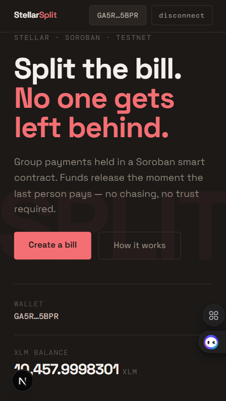
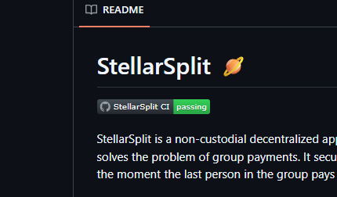
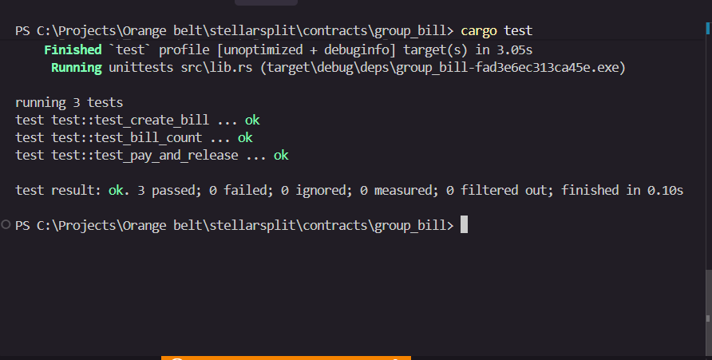

# StellarSplit 🪐

[](https://github.com/SATISH-JALAN/stellarsplit/actions/workflows/ci.yml)

StellarSplit is a non-custodial decentralized application (dApp) built on **Stellar** and **Soroban smart contracts** that solves the problem of group payments. It securely holds funds in an on-chain escrow, and automatically releases them the moment the last person in the group pays their share. No chasing, no trust required.

## 🚀 Live Demo & Links

- **Live Demo**: [Insert Vercel/Netlify Link Here]
- **Public GitHub Repository**: [https://github.com/SATISH-JALAN/stellarsplit](https://github.com/SATISH-JALAN/stellarsplit)

## 🛠 Features

- **Smart Contract Escrow**: Funds are securely locked in a Soroban Treasury contract.
- **Auto-Release**: The exact moment a group bill is fully funded, the Treasury automatically disperses the funds to the payee.
- **Freighter Wallet Integration**: Connect and sign transactions seamlessly using the Stellar Freighter extension.
- **Mobile Responsive UI**: Built with Next.js and Tailwind CSS, fully responsive across desktop, tablet, and mobile devices.
- **CI/CD Pipeline**: Automated Rust tests run on every push and pull request via GitHub Actions.

## 📸 Showcase

### 1. Mobile Responsive UI


### 2. CI/CD Pipeline Running


### 3. Test Output (3+ Passing Tests)


## 🔗 Stellar Testnet Contracts

StellarSplit relies on two inter-linked Soroban contracts deployed on the Stellar Testnet:

1. **GroupBill (Orchestrator)**: Manages bill creation and handles cross-contract invocations.
   - **Contract ID**: `CC53VWUG5ZPLAOCPUGZZLE7LQKQA6WAE25DMEDXK57WAUC3UQYNKZOAW`
2. **Treasury (Escrow)**: Holds the funds securely and releases them upon condition fulfillment.
   - **Contract ID**: `CAFEB2PJHL2DMHZG6AN2M4GN5HTHZGPGTEP3U6P3DDTPCKXSJRD7VOTZ`

### Example Transaction Hash
- **Contract Interaction (Initialization/Deployment)**: `b9e6af809d93eeaa6116288fe01370b14c4b07535afe6fd83ce5c18e1bc3bfd1`

## 💻 Tech Stack

- **Frontend**: Next.js 14, React, Tailwind CSS
- **Wallet**: `@stellar/freighter-api`
- **Blockchain**: Stellar Testnet, Soroban SDK (`v23`)
- **Languages**: TypeScript (Frontend), Rust (Smart Contracts)
- **CI/CD**: GitHub Actions

## 🏗 Local Development

### Prerequisites
- Node.js (`v18` or higher)
- Rust and Cargo (`wasm32-unknown-unknown` target installed)
- Stellar CLI installed

### Running the Frontend
```bash
# 1. Install dependencies
npm install

# 2. Run the development server
npm run dev
```
Open `http://localhost:3000` to view the dApp.

### Running the Smart Contract Tests
```bash
cd contracts/group_bill
cargo test
```

## 📝 License
MIT License
